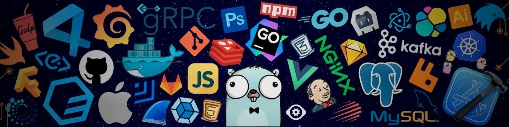

<h1 width="100%" align="center">
  
    
  
</h1>
---

### A Professional Web Developer 🚀  
- 🛜 **Currently working on**: [Webpage](https://foritbd.com/)  
- 🌍 **Location**: Rangpur, Bangladesh  
- 👨‍💻 **Role**: Full-stack Developer  
- 🌱 **Learning**: Python  
- 📚 **Goal**: Passionately pursuing MERN Stack Development  
- 🚀 **Mission**: Crafting exceptional web experiences  
- 💡 **Philosophy**: Committed to continuous innovation through code  
- ⚡ **Fun Fact**: I love coding and creating beautiful, creative, and animated websites!  

---

### 🌐 Connect with Me:
- 🌟 [Portfolio](https://foritbd.com/)
- 💼 [LinkedIn](https://linkedin.com/in/mrrayhan246)  
- 🐦 [Facebook](https://facebook.com/mrrayhan24)  
- 📧 [Email](mailto:mrrayhan246@gmail.com)  

---

### 🛠️ Skills and Tech Stack:

---

### 🐍 GitHub Activity Snake:
<picture>
  <source media="(prefers-color-scheme: dark)" srcset="https://raw.githubusercontent.com/tobiasmeyhoefer/tobiasmeyhoefer/output/github-snake-dark.svg" />
  <source media="(prefers-color-scheme: light)" srcset="https://raw.githubusercontent.com/tobiasmeyhoefer/tobiasmeyhoefer/output/github-snake.svg" />
  
</picture>

---

# 📊 GitHub Stats:

  
   
  
   
  

## 🏆 GitHub Trophies

### 🔝 Top Contributed Repo

---

<!-- Proudly created with GPRM ( https://gprm.itsvg.in ) -->

### 📊 GitHub Stats:

  
  

---

### 💡 Let's Create Something Amazing Together!

