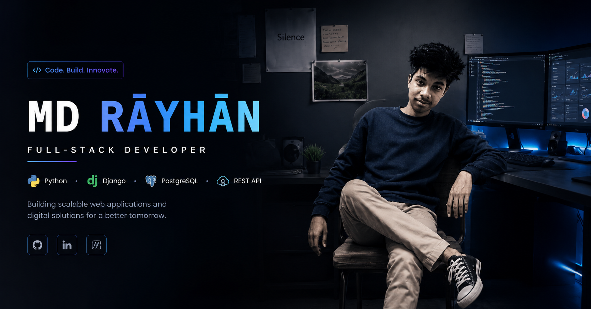

  

<h3 align="center">Building scalable web applications and digital solutions for a better tomorrow.</h3>

  
  
  
  

 

## 👨‍💻 About Me

I bridge the gap between robust system infrastructure and seamless web application development, ensuring that everything from server configuration to the user interface runs flawlessly. 

- 🔭 **Current Focus:** Executive (IT) at Kaizer Knitwears Ltd. and Full Stack Developer at FOR IT.
- 🌱 **Specialties:** Computer networking, system troubleshooting, and full-stack web development.
- 🏗️ **What I Build:** Custom Django models, class-based views, and responsive Tailwind CSS layouts.
- ⚡ **Off-Screen:** Exploring new places, listening to music, or optimizing emulator performance for gaming.
- 📍 **Location:** Gazipur, Dhaka, Bangladesh.

 

## 🛠️ Tech Stack & Tools

**Backend & Databases**

  
  
  
  
  

 

**Frontend & Design**

  
  
  

 

**DevOps, Servers & Tools**

  
  
  
  

 

## 📊 GitHub Stats

  
  

 

  

 
 

  <i>"Code. Build. Innovate."</i>

